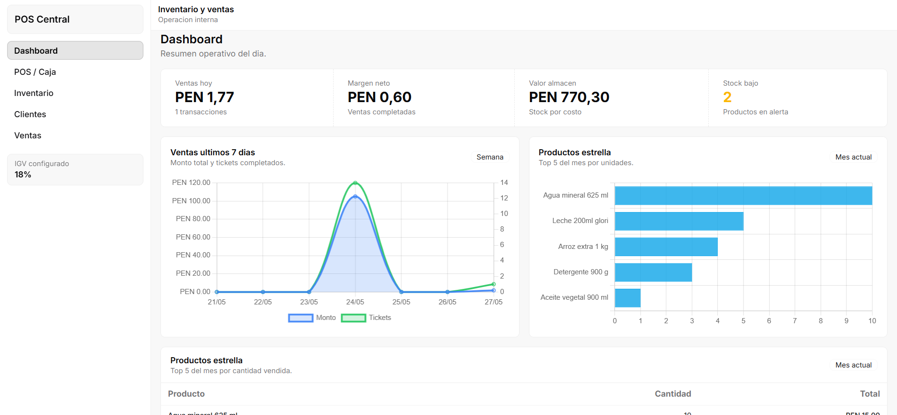
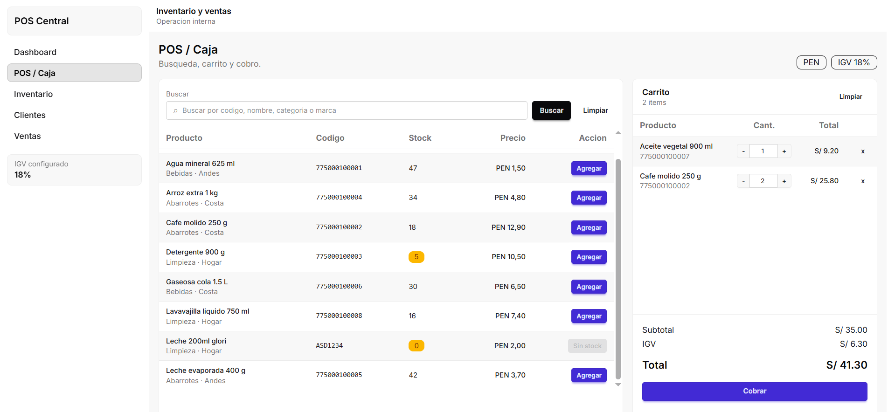
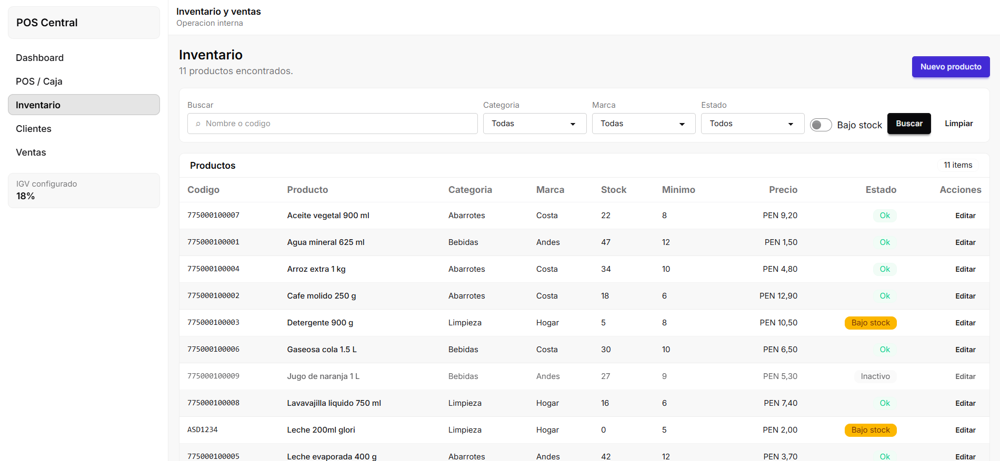
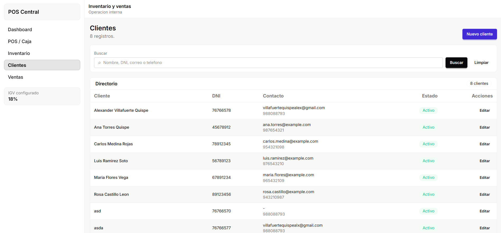
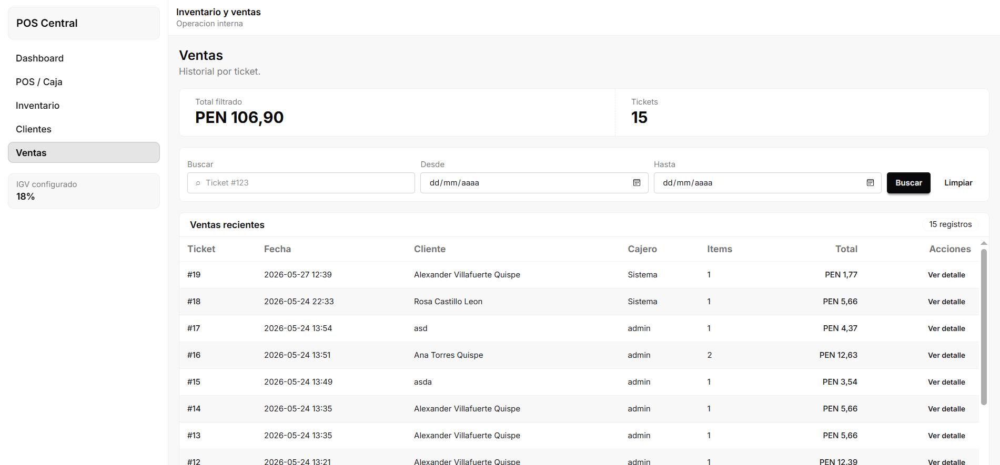

# Sistema de Inventario y Ventas

El proyecto **Sistema de Inventario y Ventas** es una aplicación web desarrollada con Django y Python. El sistema permite gestionar productos, inventario, clientes y ventas mediante una interfaz web.



### Funcionalidades principales

- Catalogo de productos con control de stock.
- POS con carrito en tiempo real y validaciones de cantidad.
- Historial de ventas con filtros.
- Gestion de clientes con validaciones basicas.

## Pantallas principales

### POS / Caja

Punto de venta con carrito, seleccion de cliente y calculo de totales.



Datos validos:
- Cantidad por producto: minimo 1 y maximo igual al stock disponible.
- `tax_rate`: valor numerico mayor o igual a 0.
- Productos: deben estar activos y con stock suficiente.

Restricciones:
- No se procesa venta sin cliente activo seleccionado.
- No se permite vender cantidades mayores al stock ni valores negativos.
- El carrito no puede estar vacio.

### Inventario

Gestion de productos, stock, estado y filtros (categoria, marca, bajo stock).



Datos validos:
- `stock` y `min_stock` entre 0 y 10,000.
- `price` mayor que 0; `cost` mayor o igual a 0.
- `barcode` y `name` son obligatorios.

Restricciones:
- `barcode` es unico.
- Solo se aceptan valores numericos en `stock` y `min_stock`.
- Productos inactivos no aparecen en el POS.

### Clientes

Gestion de clientes con busqueda, creacion y edicion.



Datos validos:
- `document_id` con 8 digitos numericos.
- `phone` con 9 digitos numericos.
- `email` opcional con formato valido.

Restricciones:
- `document_id` y `email` son unicos si se registran.
- `document_id` y `phone` no pueden estar vacios.

### Ventas

Historial de ventas con filtros por ticket y rango de fechas.



Datos validos:
- `ticket`: valor numerico (id de la venta).
- `from` y `to`: formato YYYY-MM-DD.

Restricciones:
- Si `ticket` no es numerico o las fechas no son validas, se ignoran los filtros.
- Se muestran hasta 200 ventas por consulta.

---

## Requisitos del sistema

- Python 3.10 o superior
- Pip
- Navegador web (Chrome, Edge o Firefox)

---

## Como ejecutar el programa

1. Instalar dependencias:
	```bash
	python -m pip install -r requirements.txt
	```
2. Aplicar migraciones:
	```bash
	python manage.py migrate
	```
3. Cargar datos de prueba:
	```bash
	python manage.py seed_demo
	```
4. Iniciar el servidor:
	```bash
	python manage.py runserver
	```
5. Abrir el sistema en el navegador:
	```text
	http://127.0.0.1:8000
	```

---

## Pruebas (caja negra)

- Ejecutar toda la suite:
  ```bash
  python -m pytest -q
  ```
- Ejecutar con salida detallada:
  ```bash
  python -m pytest -v
  ```

---

## Datos validos

- Producto: `stock` y `min_stock` entre 0 y 10,000.
- Producto: `price` mayor que 0; `cost` mayor o igual a 0.
- Cliente: `document_id` con 8 digitos y `phone` con 9 digitos.
- POS: cantidad de venta minimo 1 y maximo igual al stock disponible.

---

## Restricciones

- `barcode` de producto es unico.
- `document_id` y `email` de cliente son unicos si se registran.
- No se puede procesar venta sin cliente activo seleccionado.
- No se permite vender cantidad mayor al stock ni valores negativos.

---

## Recomendaciones para pruebas manuales

- Crear, editar y eliminar productos.
- Probar limites de stock y min_stock.
- Procesar ventas con cantidades validas e invalidas.
- Registrar clientes con DNI y telefono validos.

---

## Observaciones

Seguir estos pasos asegura la ejecucion correcta del sistema y permite validar los flujos principales con datos reales y pruebas automatizadas.
